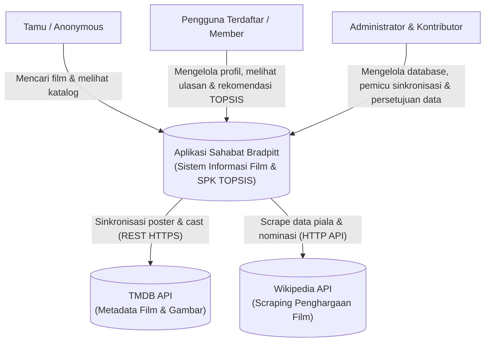
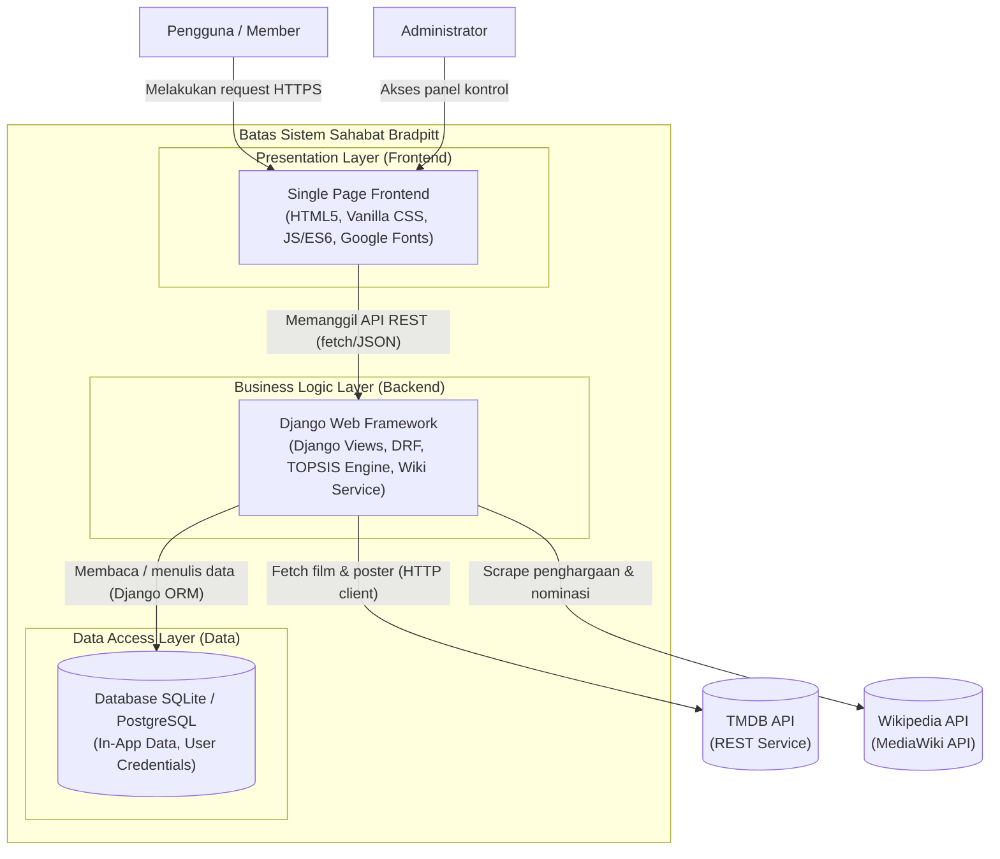

# 🌐 C4 Architecture Model - Sahabat Bradpitt

## Bab III: Arsitektur Sistem (C4 Model & 3-Layer)

Dokumen ini mendokumentasikan arsitektur sistem Sahabat Bradpitt menggunakan pemodelan **C4 Model** (Context & Container) untuk memperjelas batas-batas sistem, interaksi komponen, serta kepatuhan terhadap pola arsitektur **3-Layer Architecture** (Presentation, Business Logic, Data Access).

---

### 3.1 C4 Context Diagram (Tingkat Lanjut)

Diagram ini mengidentifikasi pengguna sistem (aktor) dan sistem eksternal (TMDB API & Wikipedia API) yang berinteraksi langsung dengan aplikasi Sahabat Bradpitt.

---

### 3.2 C4 Container Diagram

Diagram kontainer ini menunjukkan bagian dalam sistem Sahabat Bradpitt, teknologi yang digunakan, serta bagaimana data mengalir di antara kontainer-kontainer tersebut.

---

### 3.3 Kepatuhan Arsitektur 3-Layer (Separation of Concerns)

Aplikasi Sahabat Bradpitt secara disiplin memisahkan kode program ke dalam tiga lapisan logis untuk memastikan kualitas kode tetap bersih, modular, dan mudah dipelihara:

1. **Presentation Layer (Lapisan Presentasi)**:
   - **Teknologi**: Berkas HTML Django Templates, Vanilla CSS, dan modul Javascript di direktori `static/js/`.
   - **Tanggung Jawab**: Menampilkan antarmuka pengguna yang sangat responsif, merender active tab transition di profil, dan menangani event-click (seperti membuka preferensi accordion atau menekan tombol "Lihat Selengkapnya").
   - **Pembatasan**: Tidak boleh ada query database langsung atau penghitungan rumus matematis TOPSIS di lapisan ini.

2. **Business Logic Layer (Lapisan Logika Bisnis)**:
   - **Teknologi**: Berkas views Django, Django REST Framework API Views, `sync_tmdb.py`, `wiki_service.py`, dan `topsis_user.py`.
   - **Tanggung Jawab**: Memproses logika perhitungan bobot TOPSIS, mengimpor penghargaan Wikipedia berdasarkan `release_year`, menyinkronkan data TMDB, serta memeriksa validasi peran pengguna (RBAC).
   - **Pembatasan**: Bersifat agnostik terhadap jenis database yang digunakan dan tidak mengurus visual render CSS/HTML secara langsung.

3. **Data Access Layer (Lapisan Akses Data)**:
   - **Teknologi**: Model Django (`models.py`) dan Django Serializers (`serializers.py`).
   - **Tanggung Jawab**: Mendefinisikan skema tabel database (termasuk kolom baru seperti `local_poster`, `tmdb_poster`, dll), mengurus relasi antar tabel (M2M, FK), serta melakukan serialisasi data dari query Django ORM ke dalam format JSON.
   - **Pembatasan**: Bebas dari logika kalkulasi TOPSIS global maupun manipulasi antarmuka visual.
