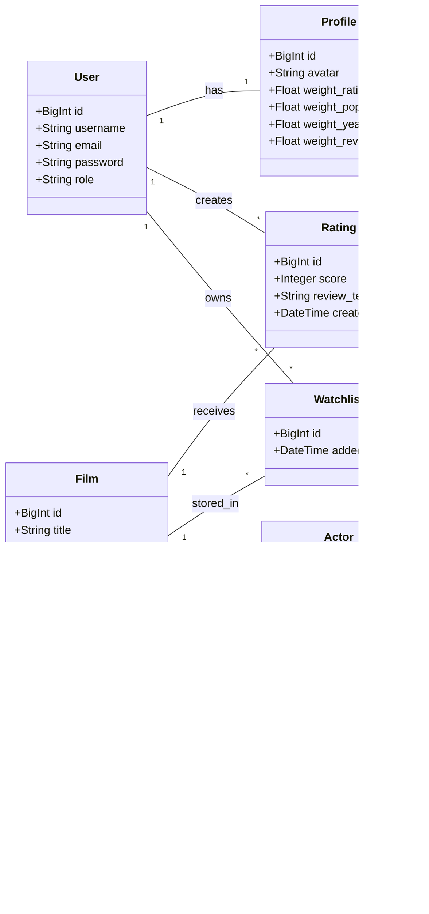
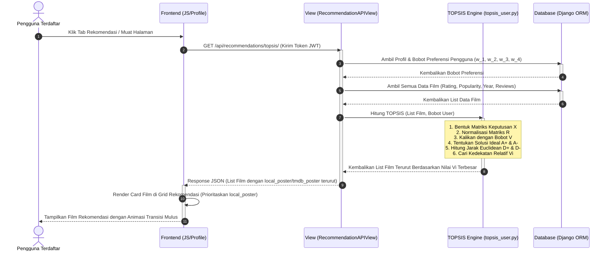

# 📊 UML Diagrams - Sahabat Bradpitt

## Bab III: Desain Sistem & Arsitektur Perangkat Lunak

Dokumen ini menyediakan diagram UML formal yang dimodelkan menggunakan kode **Mermaid HD**. Anda dapat langsung menyalin kode Mermaid di bawah ini ke editor visual seperti **Draw.io** atau **Mermaid Live Editor** untuk menghasilkan diagram berkualitas tinggi untuk laporan Tugas Akhir/Skripsi.

---

### 3.1 Use Case Diagram

Diagram ini menggambarkan interaksi antara aktor (Tamu, Pengguna Terdaftar, Kontributor, Administrator) dengan fungsionalitas inti sistem Sahabat Bradpitt berbasis **Role-Based Access Control (RBAC)**.

```mermaid
rect list
    state "Use Case Diagram - Sahabat Bradpitt"
end
graph TD
    %% Aktor
    Tamu[Tamu / Anonymous]
    User[Pengguna Terdaftar]
    Contrib[Kontributor]
    Admin[Administrator]

    %% Pewarisan Aktor
    User --> Tamu
    Contrib --> User
    Admin --> Contrib

    %% Use Cases
    subgraph "Sistem Sahabat Bradpitt"
        UC01(Melakukan Pencarian Film Cerdas)
        UC02(Melihat Katalog & Detail Film/Aktor)
        UC03(Mengelola Profil & Preferensi Kustom)
        UC04(Memberikan Rating & Ulasan Film)
        UC05(Mengelola Watchlist)
        UC06(Melihat Rekomendasi TOPSIS)
        UC07(Mengusulkan Data Film/Aktor Baru)
        UC08(Memicu Sinkronisasi TMDB Parsial)
        UC09(Menyetujui Suntingan Data / Approvals)
        UC10(Menjalankan Wikipedia Accolades Importer)
        UC11(Mengelola Pengguna & Peran RBAC)
    end

    %% Hubungan Aktor & Use Cases
    Tamu --> UC01
    Tamu --> UC02

    User --> UC03
    User --> UC04
    User --> UC05
    User --> UC06

    Contrib --> UC07
    Contrib --> UC08

    Admin --> UC09
    Admin --> UC10
    Admin --> UC11
```

---

### 3.2 Class Diagram (Database Schema & Relationships)

Diagram kelas ini menyajikan skema tabel database Django yang telah diselaraskan dengan nama kolom baru (`local_poster`/`tmdb_poster`, `local_photo`/`tmdb_photo`, `local_logo`/`tmdb_logo`) beserta relasi antar model.



---

### 3.3 Sequence Diagram: Kalkulasi Rekomendasi TOPSIS

Diagram urutan ini menunjukkan alur interaksi dinamis saat Pengguna Terdaftar membuka halaman profil/rekomendasi dan sistem menghitung rekomendasi hibrida TOPSIS secara *real-time*.


