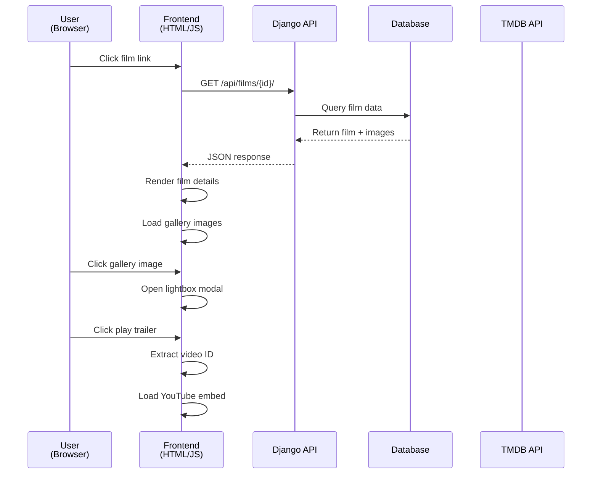
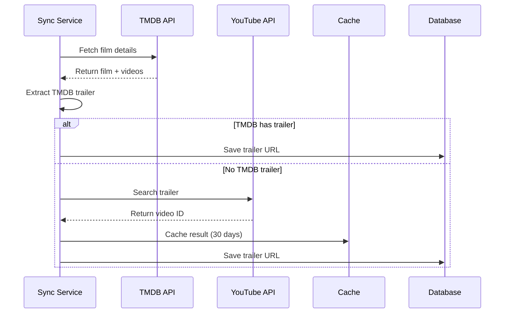
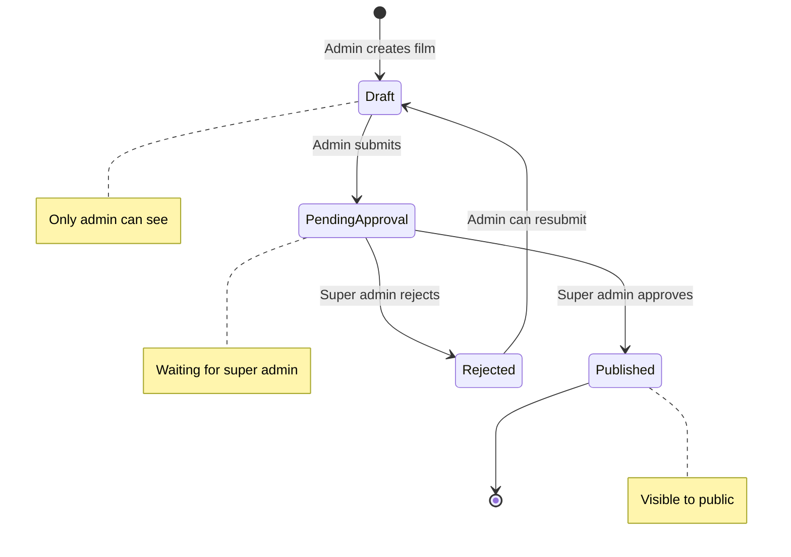
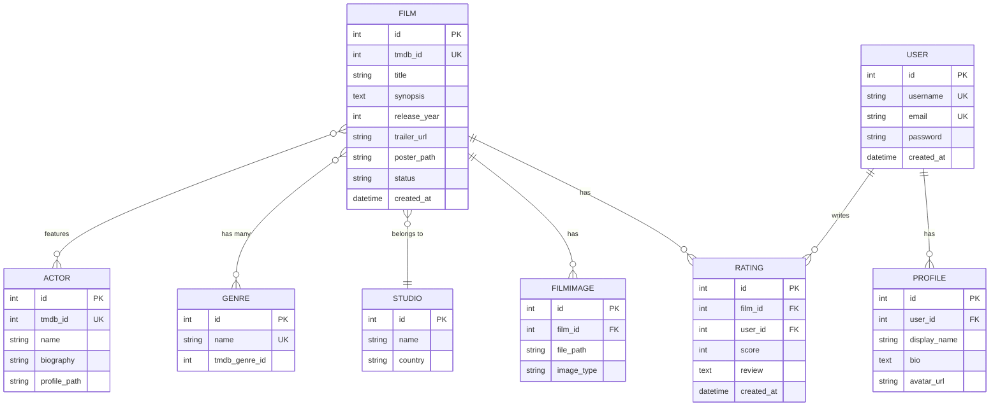
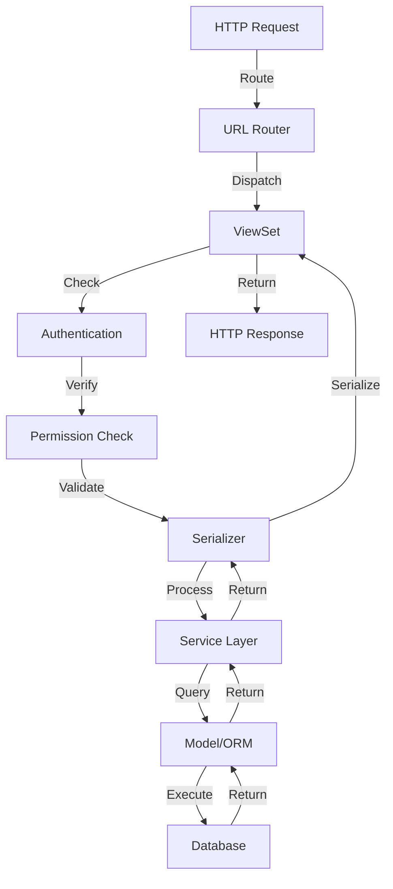
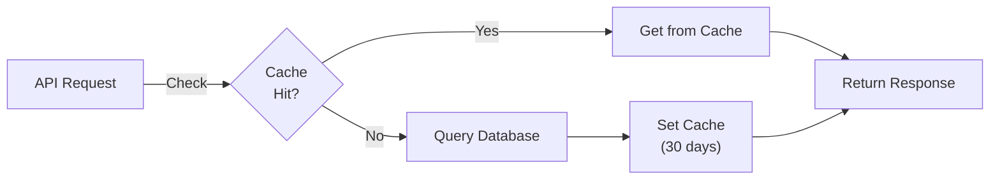
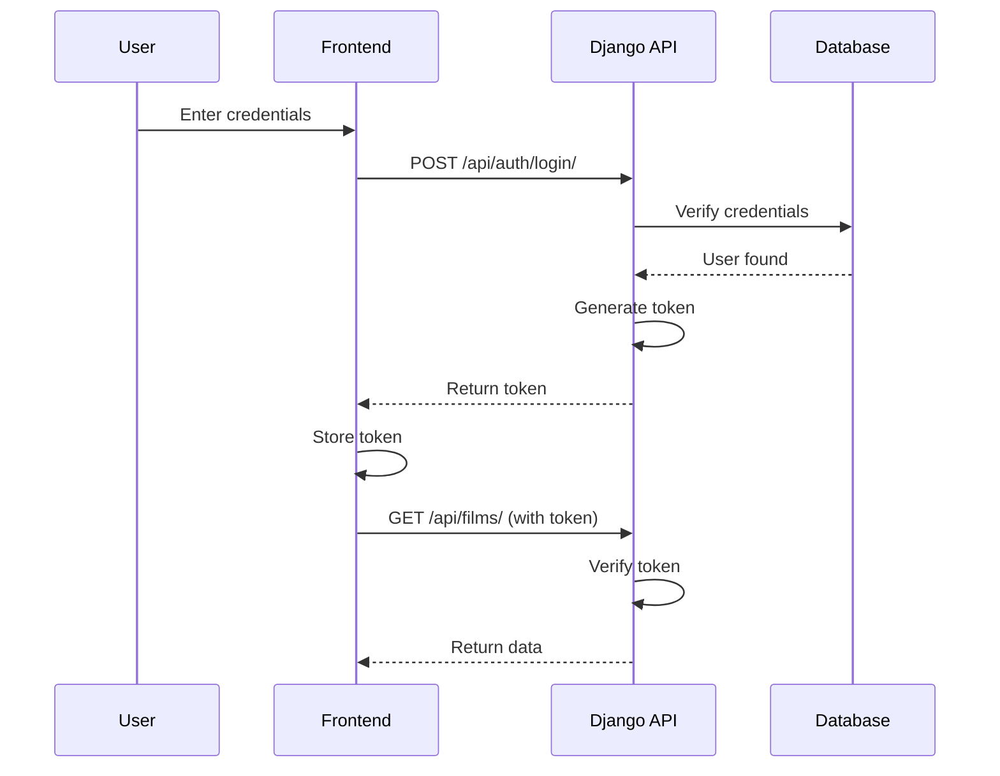
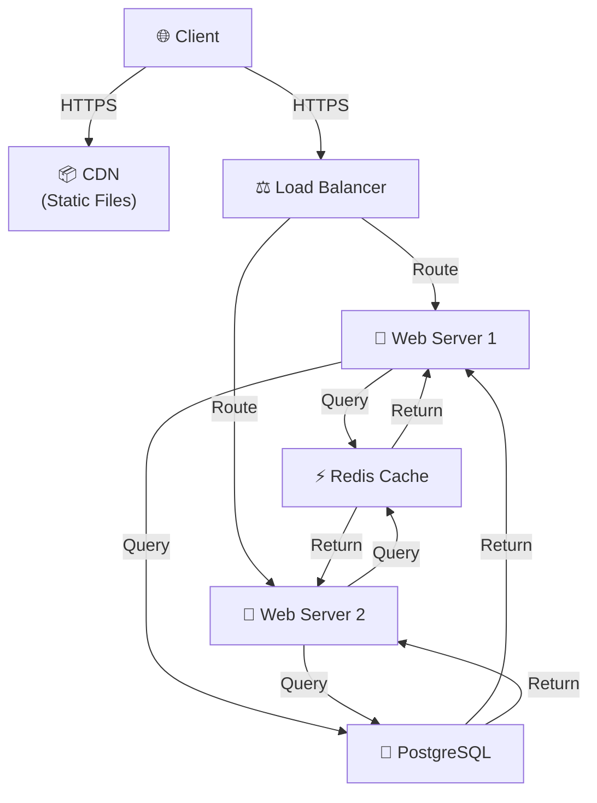
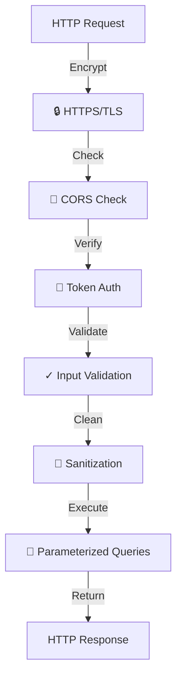

# 🏗️ Architecture Documentation

**System design, components, and data flow for SahabatBradPitt project.**

---

## System Architecture Overview

```mermaid
graph TB
    Client["🌐 Client<br/>(Browser)"]
    Frontend["📱 Frontend<br/>(HTML/CSS/JS)"]
    Django["🐍 Django<br/>(REST API)"]
    DB[(💾 Database<br/>(SQLite/PostgreSQL))]
    TMDB["🎬 TMDB API"]
    YouTube["▶️ YouTube API"]
    Cache["⚡ Cache<br/>(Redis/Memory)"]
    
    Client -->|HTTP/AJAX| Frontend
    Frontend -->|REST API| Django
    Django -->|Query| DB
    Django -->|Fetch Data| TMDB
    Django -->|Search Trailer| YouTube
    Django -->|Cache| Cache
    Cache -->|Return| Django
```

---

## Component Architecture

```mermaid
graph LR
    subgraph Frontend["Frontend Layer"]
        HTML["HTML Templates"]
        CSS["CSS Styling"]
        JS["JavaScript Logic"]
    end
    
    subgraph API["API Layer"]
        Auth["Authentication"]
        Endpoints["REST Endpoints"]
        Serializers["Serializers"]
    end
    
    subgraph Business["Business Logic"]
        Services["Services"]
        Models["Models"]
        Validators["Validators"]
    end
    
    subgraph Data["Data Layer"]
        ORM["Django ORM"]
        DB["Database"]
        Cache["Cache"]
    end
    
    Frontend -->|API Calls| API
    API -->|Process| Business
    Business -->|Query| Data
    Data -->|Return| Business
    Business -->|Response| API
    API -->|JSON| Frontend
```



---

## Module Structure

```
SahabatBradPitt/
│
├── apps/
│   ├── films/                    # Film management
│   │   ├── models.py            # Film, FilmImage models
│   │   ├── views.py             # FilmViewSet
│   │   ├── serializers.py       # Film serializers
│   │   ├── services.py          # TMDB sync service
│   │   ├── youtube_service.py   # YouTube trailer service
│   │   └── urls.py              # Film endpoints
│   │
│   ├── actors/                   # Actor management
│   │   ├── models.py
│   │   ├── views.py
│   │   ├── serializers.py
│   │   └── urls.py
│   │
│   ├── users/                    # User authentication
│   │   ├── models.py            # User profile
│   │   ├── views.py             # Auth endpoints
│   │   ├── serializers.py
│   │   └── urls.py
│   │
│   ├── ratings/                  # Rating system
│   │   ├── models.py            # Rating model
│   │   ├── views.py
│   │   ├── serializers.py
│   │   └── urls.py
│   │
│   ├── festivals/                # Festival management
│   │   ├── models.py
│   │   ├── views.py
│   │   ├── serializers.py
│   │   └── urls.py
│   │
│   └── recommendations/          # Recommendation engine
│       ├── models.py
│       ├── views.py
│       ├── spk.py               # TOPSIS algorithm
│       └── urls.py
│
├── config/
│   ├── settings/
│   │   ├── base.py              # Base settings
│   │   ├── development.py       # Dev settings
│   │   └── production.py        # Prod settings
│   ├── urls.py                  # URL routing
│   └── wsgi.py                  # WSGI config
│
├── templates/                    # HTML templates
│   ├── base.html
│   ├── home.html
│   ├── film_detail.html
│   ├── film_list.html
│   ├── actor_detail.html
│   ├── profile.html
│   └── ...
│
├── static/                       # Static files
│   ├── css/
│   │   └── style.css
│   └── js/
│       └── main.js
│
├── docs/                         # Documentation
│   ├── README.md
│   ├── TECH_STACK.md
│   ├── ARCHITECTURE.md
│   ├── API.md
│   ├── DATABASE.md
│   ├── GUIDES.md
│   └── DEPLOYMENT.md
│
└── manage.py                     # Django CLI
```

---

## Data Flow Diagrams

### Film Detail Page Flow



### Trailer Search Flow



### Approval Workflow



---

## Database Schema Overview



---

## API Layer Architecture



---

## Caching Strategy



---

## Authentication Flow



---

## Deployment Architecture



---

## Key Design Patterns

### 1. **ViewSet Pattern**
```python
class FilmViewSet(viewsets.ModelViewSet):
    queryset = Film.objects.all()
    serializer_class = FilmSerializer
    permission_classes = [IsAdminUser]
```

### 2. **Service Layer Pattern**
```python
class TMDBService:
    def sync_brad_pitt_movies(self, limit=15):
        # Business logic here
        pass
```

### 3. **Serializer Pattern**
```python
class FilmSerializer(serializers.ModelSerializer):
    class Meta:
        model = Film
        fields = ['id', 'title', 'synopsis', ...]
```

### 4. **Permission Pattern**
```python
def get_permissions(self):
    if self.action in ['list', 'retrieve']:
        return [permissions.AllowAny()]
    return [permissions.IsAdminUser()]
```

---

## Performance Considerations

### Database Optimization
- ✅ Indexed queries on frequently searched fields
- ✅ Select_related for foreign keys
- ✅ Prefetch_related for many-to-many
- ✅ Query result caching

### API Optimization
- ✅ Pagination for large datasets
- ✅ Filtering and searching
- ✅ Response compression
- ✅ Rate limiting

### Frontend Optimization
- ✅ Lazy loading images
- ✅ Minified CSS/JavaScript
- ✅ Responsive images
- ✅ Browser caching

---

## Security Architecture



---

**Last Updated**: 2026-05-25  
**Version**: 1.0.0
